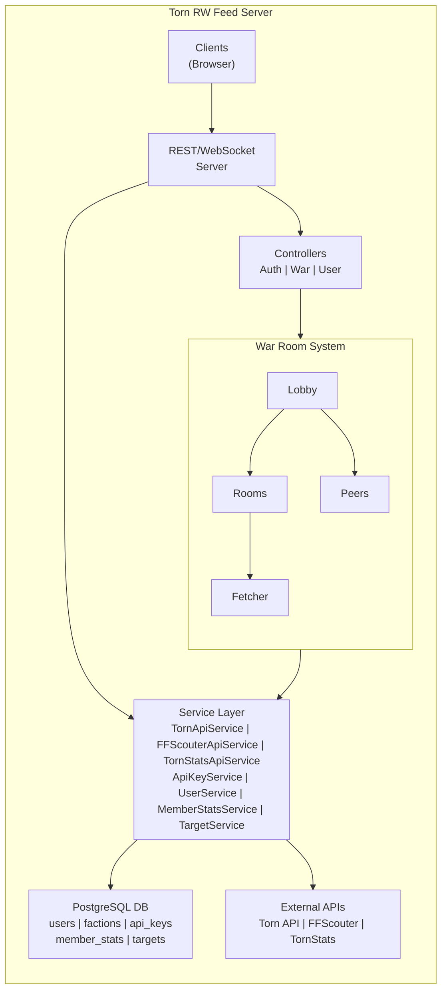

# Torn RW Feed


A high-performance, real-time faction war monitoring API for the online game [Torn](https://www.torn.com). This server aggregates data from multiple sources and delivers live updates to connected clients via WebSocket, enabling factions to coordinate their war efforts effectively.

---

## Table of Contents

- [Core Concept](#core-concept)
- [Key Features](#key-features)
- [Architecture Overview](#architecture-overview)
- [Technical Stack](#technical-stack)
- [Getting Started](#getting-started)
- [Configuration](#configuration)
- [Docker Deployment](#docker-deployment)
- [Testing](#testing)
- [CI/CD Pipeline](#cicd-pipeline)
- [License](#license)

---

## Core Concept

**Torn RW Feed** serves as a centralized backend for faction war monitoring in Torn. During ranked wars, factions need real-time information about:

- **Enemy faction members**: Current status, location, and activity
- **Battle statistics**: Battle Stat estimates from [multiple sources](#multi-source-battle-statistics)
- **Ally coordination**: Real-time visibility into faction member activities

The server maintains persistent WebSocket connections with faction members, continuously fetches data from the Torn API and third-party stat providers, and broadcasts updates to all connected peers in real-time.

### How It Works

1. **Authentication**: Users authenticate using their Torn API key, which validates their identity and faction membership
2. **Room Creation**: When a faction member connects, they join (or create) a "Room" for their faction
3. **Continuous Polling**: A `Fetcher` coroutine polls the Torn API and stat providers using pooled API keys from all connected faction members
4. **Real-time Broadcasting**: Updates are immediately pushed to all connected peers in the room
5. **Multi-source Stats**: Battle stats are aggregated from FFScouter and TornStats Spies for comprehensive intelligence

---

## Key Features

### Real-time War Monitoring
- Live WebSocket connections for instant updates
- Automatic detection of war start/end states
- Faction member status tracking (online, idle, offline, hospital, jail, traveling)

### Multi-source Battle Statistics
- **[FFScouter](https://ffscouter.com/) Integration**: Automated stat estimation based on member profiles
- **[TornStats](https://www.tornstats.com/) Spies Integration**: User-contributed spy reports for accurate stats
- Intelligent stat caching per war to minimize API calls

### Distributed API Key Pool
- Pools API keys from all signed-up faction members
- Automatic rate limit management with cooldown handling
- Key rotation to prevent hitting rate limits
- Automatic removal of invalid/revoked keys

---

## Architecture Overview


### Component Descriptions

| Component | Description |
|-----------|-------------|
| **Lobby** | Manages all faction rooms, creates/destroys rooms as factions connect/disconnect |
| **Room** | Represents an active faction war session, maintains member states and broadcasts updates |
| **Peer** | Represents a single WebSocket connection from a user |
| **Fetcher** | Async coroutine that continuously polls APIs and updates the room |
| **TornApiServiceKeyManaged** | Manages API key pool, rotation, and rate limiting |

---

## Technical Stack

| Category | Technology |
|----------|------------|
| **Language** | C++17 |
| **Framework** | [oatpp](https://oatpp.io/) - Modern C++ web framework |
| **HTTP/WebSocket** | oatpp-openssl, oatpp-websocket |
| **Database** | PostgreSQL 16 via oatpp-postgresql |
| **HTTP Client** | oatpp-curl for external API calls |
| **Cryptography** | Crypto++ for SHA-256 hashing, base64 encoding |
| **Error Tracking** | Sentry Native SDK |
| **API Documentation** | Swagger UI via oatpp-swagger |
| **Package Manager** | vcpkg |
| **Build System** | CMake with Ninja |
| **Containerization** | Docker + Docker Compose |

---

### Schema Migration

Migrations are automatically applied on startup using oatpp-postgresql's migration system. SQL files are located in `src/db/sql/{table}/init.sql`.

---

## Getting Started

### Prerequisites

- **C++17 compatible compiler** (GCC 9+, Clang 10+, MSVC 2019+)
- **CMake** 3.15+
- **Ninja** (recommended)
- **vcpkg** package manager

### Building from Source

```bash
# Clone repository with submodules
git clone --recursive https://github.com/Ben-Vollrath/torn-rw-feed.git
cd torn-rw-feed

# Bootstrap vcpkg (if not already installed globally)
./vcpkg/bootstrap-vcpkg.sh  # Linux/macOS
# or
.\vcpkg\bootstrap-vcpkg.bat  # Windows

# Configure with CMake
cmake --preset ninja-multi

# Build
cmake --build --preset build-release

# Run tests
ctest --preset test-release
```

---

## Docker Deployment

### Using Docker Compose

```bash
# Create .env file with required variables
cp .env.template .env
# Edit .env with your configuration

# Start services
docker-compose up -d

```

### Services

| Service | Port | Description |
|---------|------|-------------|
| `db` | 5432 | PostgreSQL database |
| `api` | 8000 | Torn RW Feed API server |

## Testing

### Running Tests

```bash
# After building
ctest --preset test-release

```

### Mock Responses

Test fixtures for external APIs are located in `test/MockTorn/mock_responses/`.

---

## CI/CD Pipeline

### GitHub Actions Workflows

| Workflow | Trigger | Purpose |
|----------|---------|---------|
| `ci-tests.yml` | Push, PR | Build and run tests |
| `build-release.yml` | Push Main | Build and publish Docker image |

### CI Features

- PostgreSQL service container for integration tests
- vcpkg binary caching via GitHub Packages (NuGet)
- Automatic dependency installation
- CMake preset-based configuration

---

## License

This project is licensed under the **MIT License** - see the [LICENSE](LICENSE) file for details.

---

## Acknowledgments

- [oatpp](https://oatpp.io/) - High-performance C++ web framework
- [Torn](https://www.torn.com) - The online game this tool supports
- [FFScouter](https://ffscouter.com) - Battle stat estimation service
- [TornStats](https://www.tornstats.com) - Community stat tracking platform
